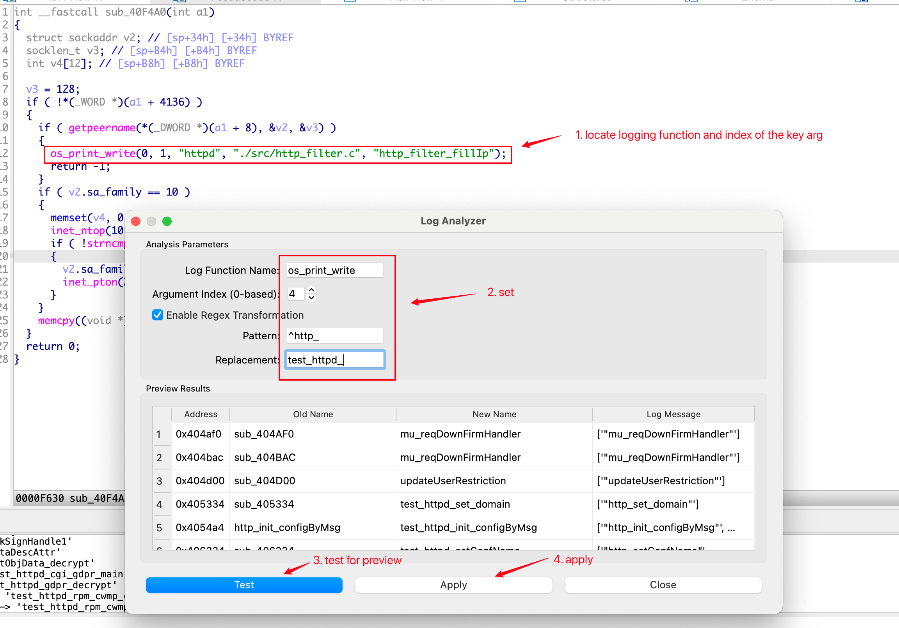

# IDADelogger for IDA Pro

**IDADelogger** is a GUI plugin for IDA Pro that automatically analyzes logging function calls and renames functions based on extracted log message parameters. It is particularly useful for firmware reverse engineering, embedded binary analysis, and malware unpacking — wherever log-based function naming is helpful.

---

## Features

- Analyze calls to a user-defined logging function (e.g., `log_print`, `os_log_write`)
- Extract a specific argument (e.g., the 4th parameter) from log calls and use it as the function name
- Supports regular expression transformation to clean or format names
- GUI preview of matched functions, old names, new names, and log messages
- One-click Apply: batch rename matched functions in IDA

---

## Screenshots


---

## Installation

1. Clone or download this repository:
```bash
git clone https://github.com/NoneShell/IDADelogger.git
```

2.	Copy the plugin file to your IDA plugin directory:

3.	Launch IDA, and in the menu, navigate to:
Edit → Log Analyzer

---

## How to Use
1.	Open a binary in IDA and let it analyze.
2.	Go to Edit → IDADelogger from the menu.
3.	In the popup window:
    •	Enter your log function name (e.g., log_print)
    •	Set the argument index (0-based) from which the log string should be extracted
    •	Optionally enable regex transformation and define pattern / replacement
4.	Click Test to preview the matched functions and their proposed names.
5.	Click Apply to rename the functions in IDA.

---

## Regex Transformation

If the log strings follow a pattern like "Handler Foo", you can use:
	•	Pattern: Handler\s+(\w+)
	•	Replacement: \1

This would rename the function to Foo.

---

## Compatibility
•	IDA Pro 7.5–8.3+
•   Python 3.x (IDA’s built-in)
•	Tested on macOS, 8.3


## License
MIT License — free to use, modify, and distribute.